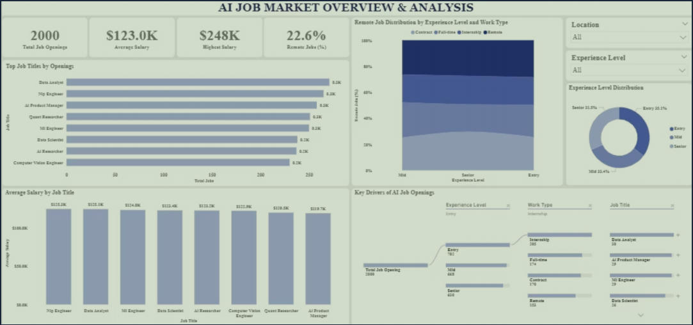
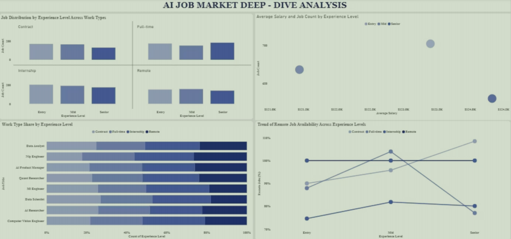

# AI Job Market Analysis
## 📸 Dashboard Preview

### 🔹 Overview Dashboard

### 🔹 Deep Dive Analysis

This project presents a Power BI dashboard analyzing AI job market trends including demand, salaries, experience levels, and work types.

## 📊 Project Overview
This dashboard helps understand:
- Job openings in AI field
- Salary trends across roles
- Experience level distribution
- Remote vs onsite work trends
- Company hiring patterns
## 📂 Dataset

The dataset used in this project is included in this repository.

- File: `dataset.csv`
- Contains:
  - Job titles and roles
  - Salary ranges
  - Experience levels
  - Work types (remote, full-time, etc.)
  - Company and location data

## 🛠 Tools Used
- Power BI
- DAX
- Microsoft Excel
- CSV Dataset

## 📌 Key Insights
- Mid-level roles dominate job openings
- Data Analyst and ML Engineer are high-demand roles
- Senior roles have higher salary packages
- Remote jobs increase with experience

## 🎯 Objective
To provide insights into AI job market trends and support better career decisions.
