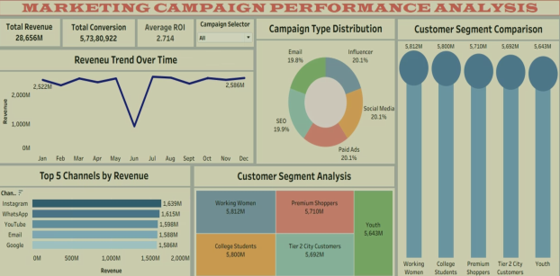

# Nykaa Campaign Performance Analysis
## 📸 Dashboard Preview

This project analyzes digital marketing campaign performance for Nykaa using data-driven insights to evaluate effectiveness across channels, audience segments, and ROI.

## 📊 Project Overview
The analysis focuses on:
- Campaign performance across multiple channels
- Audience engagement and response
- Revenue generation and ROI
- Cost efficiency and acquisition performance

## 📁 Dataset Details
The dataset includes:
- Campaign ID, Type, Target Audience
- Channel Used (Instagram, YouTube, etc.)
- Impressions, Clicks, Leads, Conversions
- Revenue and Acquisition Cost
- ROI and Engagement Score

## 📈 Dashboard Features
- Revenue trend over time
- Campaign type distribution
- Customer segment comparison
- Top-performing channels by revenue
- KPI cards for quick insights
- Interactive filters for analysis

## 🔍 Key Insights
- Paid ads generate high revenue but at higher cost
- Influencer campaigns drive strong engagement
- YouTube and Instagram are top-performing channels
- Premium customers contribute the highest revenue
- Conversion gaps indicate optimization opportunities

## 💡 Recommendations
- Optimize paid ad targeting to reduce cost
- Increase focus on influencer marketing
- Invest more in high-performing channels
- Improve landing pages for better conversion
- Implement real-time campaign monitoring

## 🛠 Tools Used
- Power BI / Excel
- Data Visualization Techniques

## 🎯 Objective
To evaluate campaign effectiveness and provide actionable insights for improving marketing performance.
